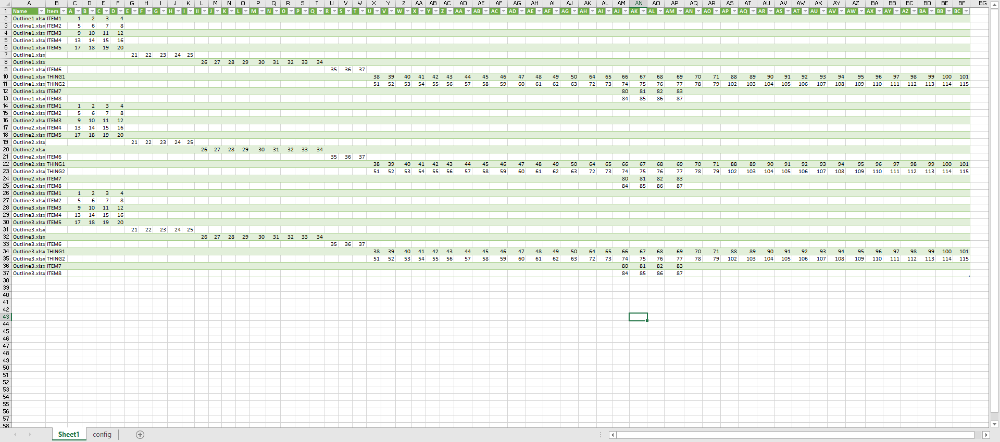

# A content reformatter

A solution to [Pull data from daily Excel files in a certain folder - VBA or Power Query?](https://www.reddit.com/r/excel/comments/9pnk8o/pull_data_from_daily_excel_files_in_a_certain/).

Download the file [here](https://github.com/tirlibibi17/r_excel-stuff/raw/master/9pnk8o/Book2.xlsx).

Put all your input files (formatted as one of the files in the input directory), and only your input files, in a separate directory and update the *input directory* value in the *config* sheet to point to that directory. Then right click inside the table in *Sheet1* and select *Refresh*.

This requires [Power Query](https://support.office.com/en-us/article/introduction-to-microsoft-power-query-for-excel-6e92e2f4-2079-4e1f-bad5-89f6269cd605?ui=en-US&rs=en-US&ad=US) so it'll only run on Windows.

Result should look something like this

.